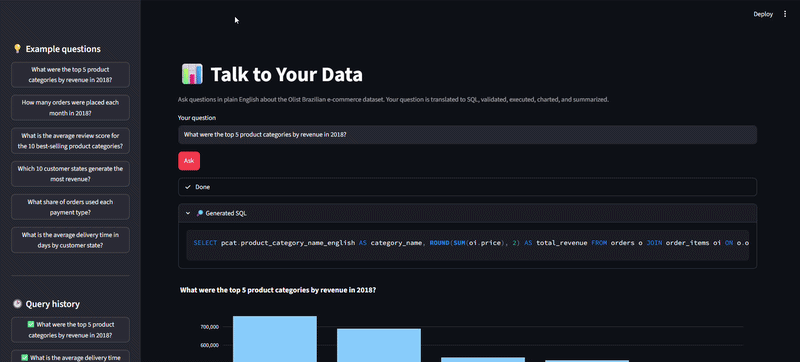
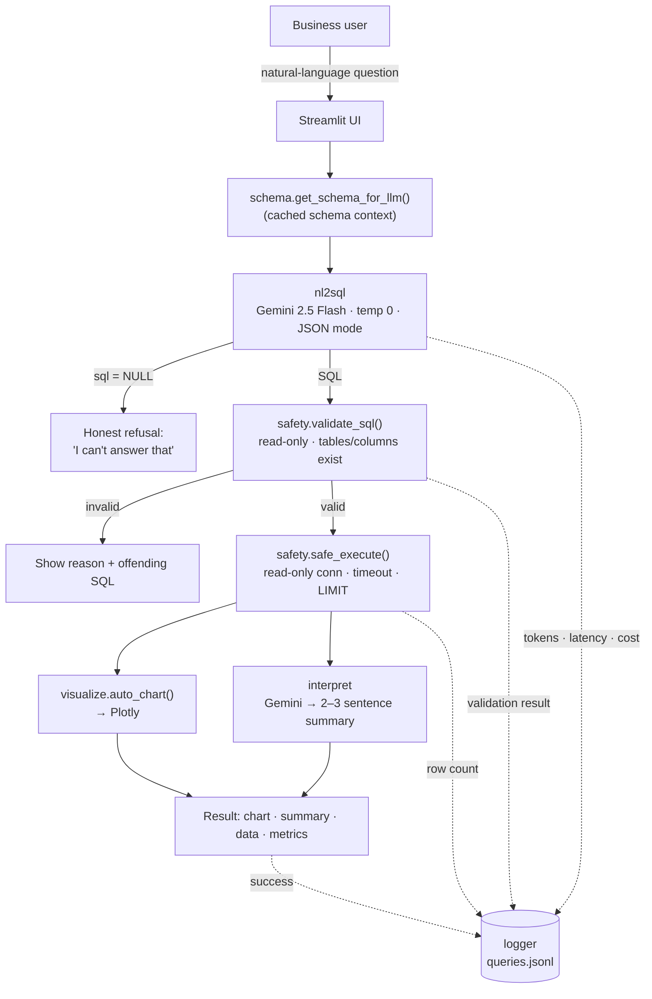

# 📊 Talk to Your Data — Natural-Language Analytics Assistant


Ask a question about an e-commerce business in plain English and get back a chart, an executive summary, and the exact SQL that produced them — with a safety layer that guarantees the generated SQL is read-only and references only real tables and columns.

<p align="center">
  
  <br><em>(Demo GIF placeholder — record with the app running locally.)</em>
</p>

---

## The problem

Analytics teams field hundreds of ad-hoc data requests per week: *"What were our top categories last quarter?"*, *"How is delivery time trending?"*, *"Which states drive the most revenue?"* Each one pulls a data analyst away from higher-value work to write a few lines of SQL, run them, and paste a chart into Slack.

**Talk to Your Data** is a self-serve layer that lets a non-technical stakeholder answer those questions themselves, safely. It translates natural language to SQL with an LLM, **validates the SQL before it ever touches the database**, executes it, auto-selects a chart, and writes a short narrative — closing the loop from question to insight in a few seconds, while logging every request for monitoring and evaluation.

It runs against the [Olist Brazilian E-Commerce dataset](https://www.kaggle.com/datasets/olistbr/brazilian-ecommerce) (~100k orders, 1.5M rows across 9 tables) but the architecture is dataset-agnostic.

## What it does

- **NL → SQL** with Google Gemini, grounded in a hand-authored schema description (the single biggest lever on accuracy).
- **A real safety layer** — single-statement, `SELECT`/`WITH`-only, no DML/DDL, every referenced table and column verified against the schema, plus a read-only database connection, a query timeout, and automatic `LIMIT` injection as defense in depth.
- **Auto-visualization** — heuristics pick a KPI card, bar, line, scatter, grouped bar, or table based on the result's shape and dtypes.
- **Executive summary** — a second LLM call turns the result into 2–3 plain-English sentences for a stakeholder.
- **Honest refusal** — questions the data can't answer (e.g. *"What's our profit margin?"*) return *"I can't answer that"* instead of a hallucinated query.
- **Observability** — every request is logged (latency, tokens, cost, validation outcome, row count, errors) to `logs/queries.jsonl`.
- **An evaluation harness** — 30 labeled questions scored automatically on SQL pattern, execution, and row-count, including 3 deliberately-impossible ones.

## Architecture



A deeper walkthrough of each component lives in [`docs/architecture.md`](docs/architecture.md).

## Tech stack

| Layer | Choice | Why |
| --- | --- | --- |
| LLM | Google **Gemini 2.5 Flash** (`google-generativeai` SDK, direct) | Fast, free tier, no framework wrapper — the mechanics are visible, not hidden behind LangChain. |
| Database | **SQLite** via **SQLAlchemy** Core | Zero-setup, typed schema with PKs/FKs/indexes; the read-only connection is enforced at the driver level. |
| UI | **Streamlit** | Fast path to a clean, interactive internal-tool UI. |
| Charts | **Plotly** | Interactive, themable, good defaults. |
| SQL parsing | **sqlparse** | Statement/keyword analysis for the validator. |
| Resilience | **tenacity** | Exponential-backoff retry on transient API errors / rate limits. |
| Testing | **pytest** | 73 tests across the safety, schema, and NL→SQL layers. |

## Setup (Windows)

> Prerequisites: **Python 3.12** (`py -3.12 --version`) and the Olist dataset from Kaggle.

```powershell
# 1. Clone and enter the project
git clone <your-repo-url>
cd talk-to-your-data

# 2. Create and activate a Python 3.12 virtual environment
py -3.12 -m venv .venv
.\.venv\Scripts\Activate.ps1
#    (If activation is blocked: Set-ExecutionPolicy -Scope Process RemoteSigned)

# 3. Install dependencies
pip install -r requirements.txt

# 4. Add the dataset
#    Download the 9 Olist CSVs from Kaggle and drop them in data\raw\ :
#    https://www.kaggle.com/datasets/olistbr/brazilian-ecommerce

# 5. Configure your Gemini API key (free, no billing)
copy .env.example .env
#    Edit .env  ->  GEMINI_API_KEY=AIza...
#    Get one at: https://aistudio.google.com/app/apikey

# 6. Build the SQLite database (idempotent; prints + verifies row counts)
python scripts\01_build_db.py

# 7. (optional) Export the human-readable schema doc to docs\schema.md
python scripts\02_export_schema_doc.py

# 8. Launch the app
streamlit run app\streamlit_app.py
```

> **Anaconda users:** swap steps 2–3 for `conda create -n ttyd python=3.12 -y && conda activate ttyd && pip install -r requirements.txt`. A standard `venv` is used here because it needs no Anaconda install and keeps the setup universally reproducible.

## Usage

Open the app, then either type a question or click an example in the sidebar:

- *What were the top 5 product categories by revenue in 2018?*
- *How many orders were placed each month in 2018?*
- *Which 10 customer states generate the most revenue?*
- *What share of orders used each payment type?*
- *What is the average delivery time in days by customer state?*

Each run shows the staged progress, the generated SQL (collapsed), the chart, the summary, the raw data (with CSV download), and a latency/token/cost footer.

**Screenshots:** _(placeholders — capture from the running app)_
`docs/screenshots/main.png` · `docs/screenshots/summary.png` · `docs/screenshots/validation_error.png`

## How it works

### The schema is the product
`src/schema.py` builds the markdown the model sees: every table and column with its type and keys, the join graph, verified enumerations (the 8 order statuses, 5 payment types), the data's date range, and the **gotchas that make naive text-to-SQL fail on Olist** — counting customers by `customer_unique_id` (not the per-order `customer_id`), revenue as `SUM(order_items.price)` in BRL, ISO date functions, and the row-multiplying `geolocation` table. Structure is introspected live from the database; semantics are hand-authored. The result is cached for the session.

### The safety layer (defense in depth)
`src/safety.py` `validate_sql()` runs before execution: it rejects multiple statements, anything that isn't `SELECT`/`WITH`, and any DML/DDL keyword, then verifies every referenced **table** and **qualified column** exists (tuned to accept CTEs, aliases, window functions, and `CAST(... AS REAL)` without false positives). Even if validation were bypassed, `safe_execute()` runs on a connection opened with `PRAGMA query_only=ON` (writes are rejected by the driver), under a wall-clock **timeout** enforced by a watchdog thread, with an automatic **`LIMIT`**. *(This validator already caught a real bug during evaluation — a `CAST(... AS REAL)` percentage query — which is now covered by a regression test.)*

### Prompt design
`src/prompts/nl2sql_system.md` embeds the schema, ten explicit modelling rules, a strict JSON output contract (`{reasoning, sql}`), and four worked examples — a simple aggregation, a 3-table join, a window-function time series, and an **unanswerable** question that must return `NULL`. Temperature is 0 for determinism.

### Evaluation
`eval/run_eval.py` scores each labeled question on four criteria — validation passes, the SQL matches an expected regex, it executes, and the row count lands in an expected range — and inverts the test for impossible questions (pass = correct refusal). It separates genuine **failures** from infrastructure **errors** (e.g. rate-limit `429`s), so the pass rate reflects model quality, not quota.

## 📊 Results

The harness evaluates the pipeline end-to-end against the labeled test set in `eval/test_questions.json`.

> **Free-tier note:** Google's free tier caps the model at ~20 requests/day, so the committed run uses the 15-question representative subset (every category, including all 3 impossible questions):
> ```powershell
> python eval\run_eval.py --subset      # free-tier friendly (15 questions)
> python eval\run_eval.py               # full 30-question set (needs higher quota / billing)
> ```
> Running either regenerates [`eval/results/latest_summary.md`](eval/results/latest_summary.md) **and** the block below.

<!-- EVAL_RESULTS_START -->
**Latest run:** 2026-06-11 16:00:59 · model `gemini-2.5-flash`  
**Pass rate (completed):** 10/11 (90.9%) · 4 errored/excluded · avg latency 4310 ms · est. cost $0.0141

| Difficulty | Pass rate |
| --- | --- |
| easy | 2/2 (100%) |
| medium | 5/5 (100%) |
| hard | 3/4 (75%) |

Full report: [`eval/results/latest_summary.md`](eval/results/latest_summary.md)
<!-- EVAL_RESULTS_END -->

## Production considerations

This is a portfolio build on a free tier; here is what would change to run it for real.

- **Cost & rate controls.** Each question is two LLM calls (~3.3k input tokens, dominated by the schema). At scale: cache the schema prompt, cache identical questions, batch/queue requests, set per-user budgets, and downshift to a cheaper model (`flash-lite`) for simple questions. The per-request cost is already logged for chargeback.
- **Caching.** The schema doc is cached per process; a production deployment would add a semantic cache (embedding similarity) over recent question→SQL pairs and a results cache keyed on the validated SQL.
- **A real warehouse.** Swapping SQLite for Snowflake/BigQuery is a `config.DB_URL` change plus dialect-aware date functions in the schema doc. The read-only guarantee would move to a dedicated read-only role/warehouse, statement timeouts, and result-byte limits — not just `LIMIT`.
- **PII & governance.** Olist is anonymized, but real data needs column-level masking, a deny-list of sensitive fields surfaced to the model, query logging for audit, and row-level security so the model can only see what the user is entitled to.
- **RBAC.** Authentication (SSO) and per-role schema scoping — each user gets a schema doc filtered to their permitted tables, so the model literally cannot reference data they can't see.
- **Observability.** `queries.jsonl` is the seed: ship it to a warehouse/Datadog, alert on validation-failure spikes, p95 latency, cost per day, and refusal rate; sample failures into the eval set to prevent regressions.

## Project structure

```
talk-to-your-data/
├── app/streamlit_app.py        # UI: wires the pipeline together
├── src/
│   ├── config.py               # all paths, model, limits, cost — single source of truth
│   ├── db.py                   # read-only SQLAlchemy engine + introspection
│   ├── schema.py               # the LLM-facing schema description (cached)
│   ├── safety.py               # validate_sql() + safe_execute()
│   ├── nl2sql.py               # question -> SQL (Gemini, retries, JSON mode)
│   ├── interpret.py            # result -> executive summary (Gemini)
│   ├── visualize.py            # auto_chart() heuristics (Plotly)
│   ├── logger.py               # JSONL query log + summary metrics
│   └── prompts/                # nl2sql + interpret system prompts
├── scripts/                    # 01_build_db.py, 02_export_schema_doc.py
├── eval/                       # test_questions.json, run_eval.py, results/
├── tests/                      # test_safety.py, test_schema.py, test_nl2sql.py
├── docs/                       # architecture.md, schema.md, screenshots/
└── data/                       # raw/ (CSVs, gitignored) + olist.db (built)
```

## Testing

```powershell
pytest            # 73 tests: SQL validation, schema introspection, NL→SQL helpers
```

The suite runs offline (no API calls): it covers the safety validator against a battery of valid/invalid queries, schema introspection and the generated doc, and the deterministic NL→SQL helpers (fence stripping, JSON parsing, the unanswerable path).

## License

[MIT](LICENSE) © 2026
